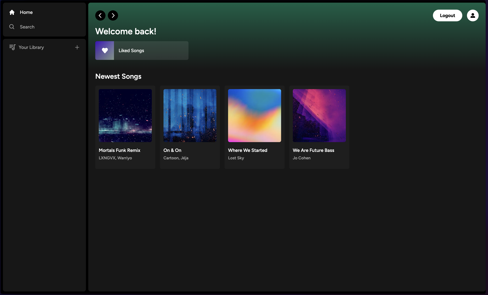
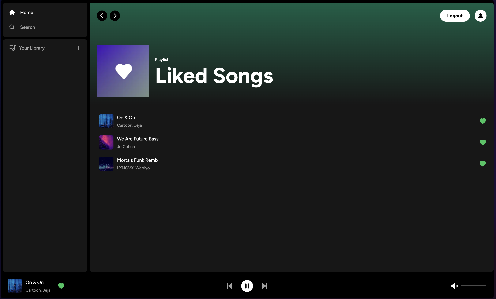

# 🎵  Spotify Clone (Full‑Stack, Next .js App Router)

A full‑stack music‑streaming platform that recreates the core experience of Spotify:

* **Play, pause & queue any track** uploaded by the community  
* **Like ❤️ & manage your library** across devices  
* **Upload your own songs & cover art** (stored on Supabase)  
* **Upgrade to Premium** – recurring payments handled by Stripe  
* **Responsive UI** that feels native on mobile & desktop  

> **Live demo**: <https://spotify-clone-8s81m30j5-amirintechs-projects.vercel.app/>  
> *(Use Stripe test cards in the checkout modal.)*

---

## ✨ Features

| Category | Details |
|----------|---------|
| **Authentication** | Supabase e‑mail / GitHub OAuth with protected server actions |
| **Audio Player** | Play / pause, next / previous |
| **User Library** | “Liked Songs” playlist persisted per user & synced in real‑time |
| **Payments** | Stripe Checkout & webhooks for monthly / yearly “Premium” subscription |
| **Responsive Design** | Tailwind CSS + Radix UI = buttery‑smooth animations & dark theme |
| **Type‑safe** | End‑to‑end TypeScript with Zod validation & generated Supabase types |

---

## 🛠️ Tech Stack

| Layer | Libraries |
|-------|-----------|
| **Frontend** | Next .js 13 App Router, React 18, Tailwind CSS, Radix UI |
| **State / Hooks** | Zustand, React‑Hook‑Form, Zod |
| **Backend** | Supabase (PostgreSQL + Auth + Storage) |
| **Payments** | Stripe SDK & Signed Webhooks |
| **Tooling** | ESLint, Prettier, React‑Hot‑Toast, React‑Icons |

---

## 🗂️ Project Structure

```text
.
├─ app/                 # Next .js routes (App Router)
├─ components/          # UI widgets (player, sidebar, modals…)
├─ hooks/               # Client & server hooks (zustand, data fetching)
├─ libs/                # Stripe & Supabase helpers
├─ providers/           # Context providers (Auth, Toast, Modal)
├─ public/              # Static assets
└─ types_db.ts          # Generated Supabase types
```

---

## 🖼️ Screenshots

| Home | Player |
|------|--------|
|  |  |

*(Add your own screenshots to `public/readme/*` and the table will render on GitHub.)*

---

## ⚠️ Disclaimer

This project is **for learning purposes only** and is **not affiliated with Spotify AB**.  
All trademarks belong to their respective owners.
